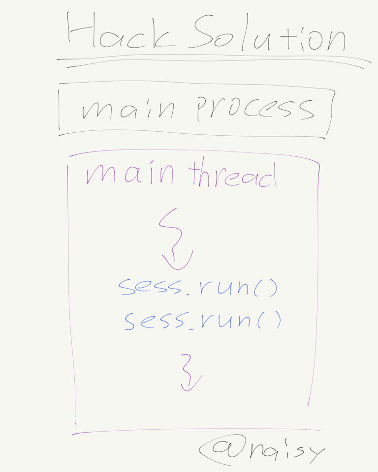
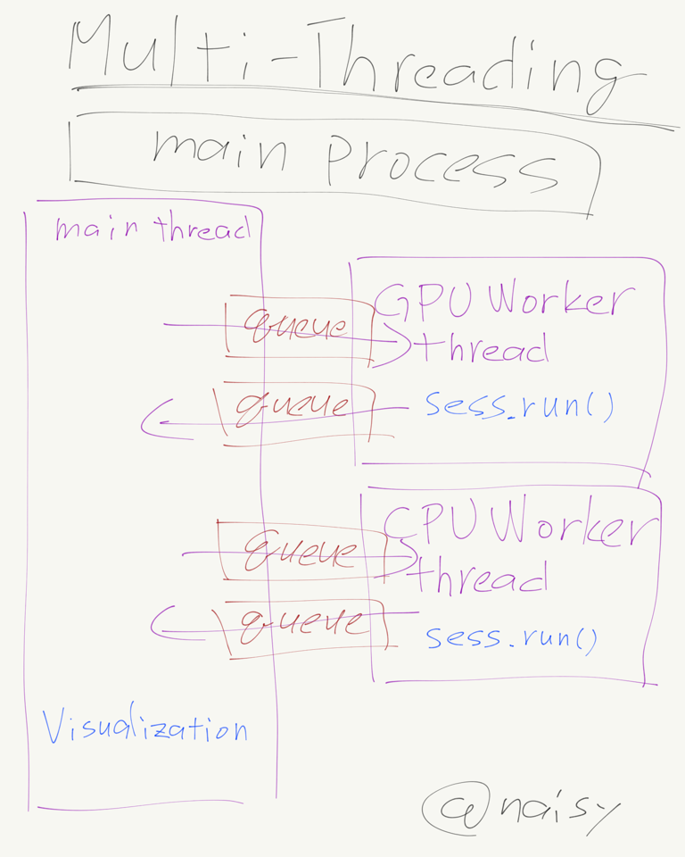
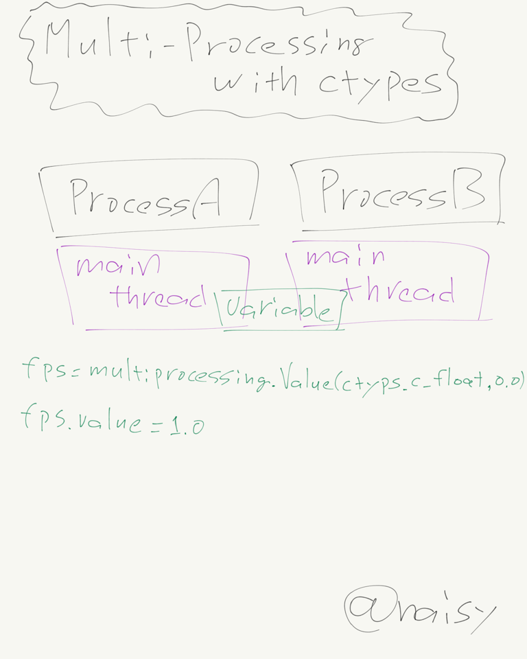
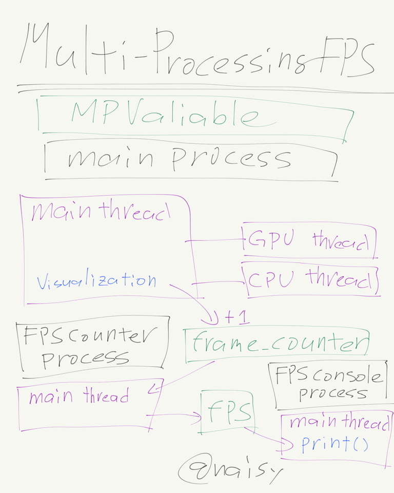
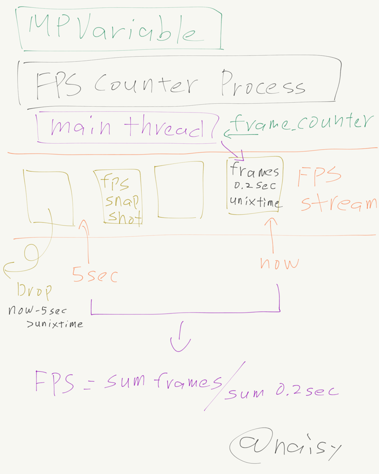
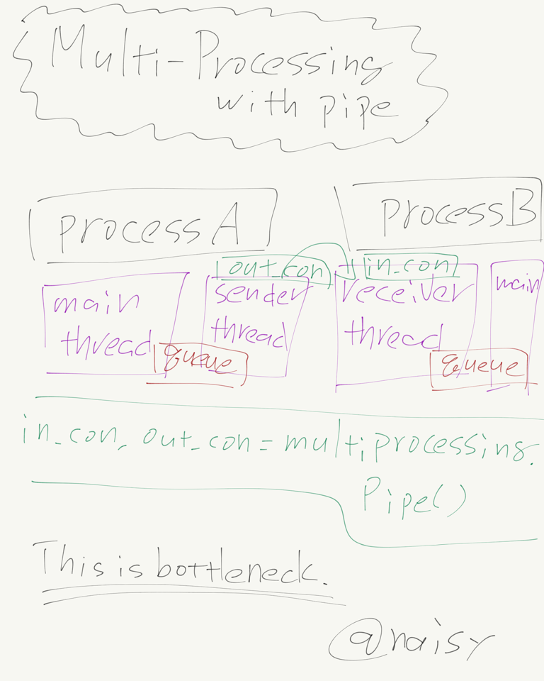
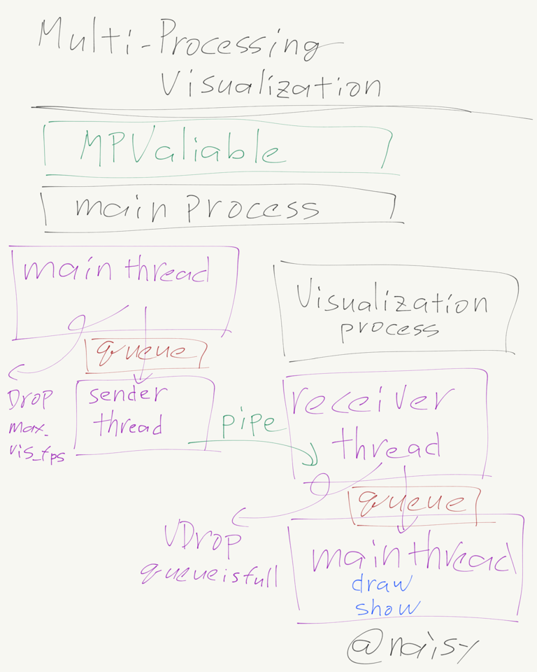
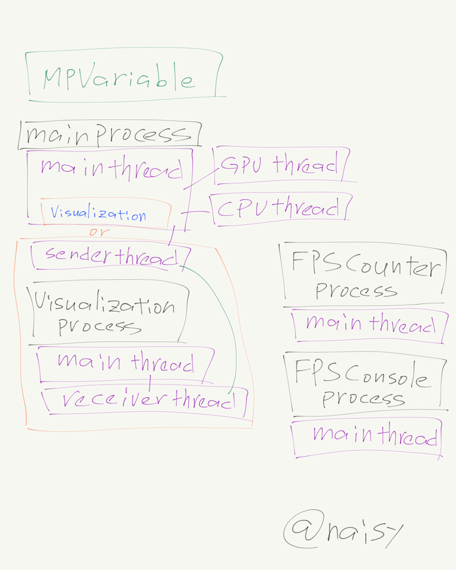
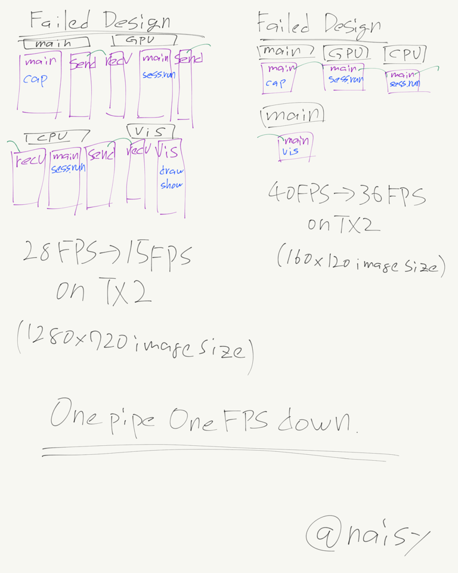

# Multi-Threading for Realtime Object Detection

## The first split model was created by @wkelongws.
He did nice work! 
For realtime object detection, this is the most important part. 
[https://github.com/tensorflow/models/issues/3270](https://github.com/tensorflow/models/issues/3270) 
Processing image: 
 

## The code has been summarized on github by @GustavZ.
He did nice work! 
The code uploaded up by him is easily executable and very nice. 

## From here multi-threading begins.
The Hack solution's sess.run() can be divided into threads. 
 
As a result, the main thread only checks the queue, and the GPU part and the CPU part continue to operate, respectively. 
 
Data communication between threads uses queue. 
 
Normally, because Python is influenced by GIL, multi-threading is not good design. 
But those that work with the C library are released from GIL. 
Therefore, sess.run() has a merit greater than the disadvantage of multi-threading. 

## Multi-Processing FPS.
Because the FPS counter is written in python, it remakes in multi-processing. 
Shared variables for multi-processing seem to work faster with ctypes. 
 
Design of Multi-processing FPS. 
 
Short time FPS is greatly influenced by the progress of CPU Worker. 
Therefore, in order to make flat FPS as much as possible, count a long time to get the average FPS. 
However, I would like to update FPS in short time. 
To achieve this, take a small chunk of FPS and put it in the array. 
This is an idea of FPS streaming. 
 

## Multi-Processing Visualization.
I made GPU and CPU parts multi-processing and I could not get good results. It was slower than multi-threading. 
The slow cause is in interprocess communication. 

When input image size is 1280 x 720 on PC, FPS is greatly different depending on whether it is visualized or not. With this large image size, visualization is a big bottleneck. 
So I designed to use multi-processing to limit visualization FPS. 
 
Pipe is in thread because it blocks processing at both transmission and reception. 
Data communication between main process's main thread and sender thread or visualization process's main thread and recever thread uses queue because these are to cross the thread. 
 
Visualization is very heavy. Therefore, if the receiver queue is full, it drops the data sent. This is VDrop.(Visualization worker's frame drop.) 
 
Continuing stacking without dropping the frame will be Out of Memory. 

## Current process and thread design.
 

## My failed Multi-Processing design.
 

