# Learn Split Model

## Processing Flow of Single Shot MultiBox Detector: SSD
SSD consists of three parts.<br>
1. Prepare. (Resize image to 300x300.)
2. Detection. (Find a candidate boxes.)
3. Non-Maximum Suppression. (Final detection.)
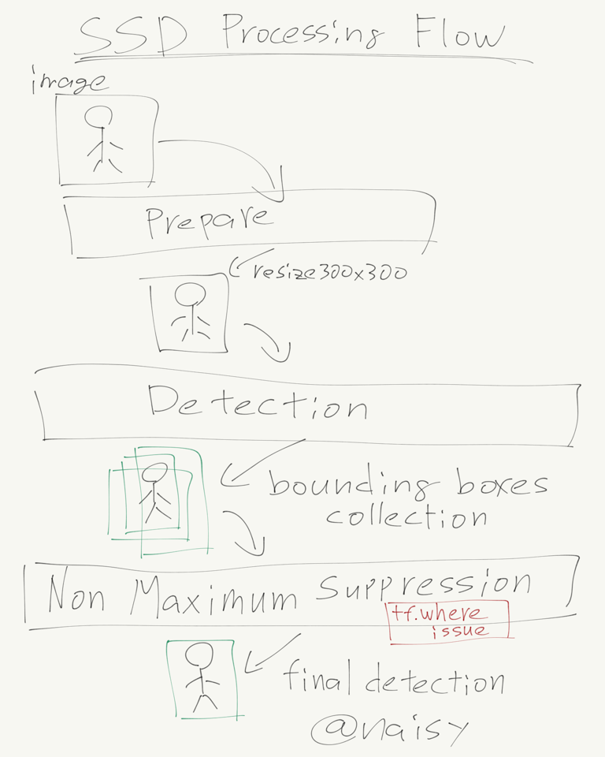<br>
Split model divides the model before and after non-maximum suppression.<br>
This split position provides an excellent performance and solves the performance problem of tf.where on GPU.<br>


## The first split model was created by @wkelongws.
He did nice work!<br>
For realtime object detection, this is the most important part.<br>
[https://github.com/tensorflow/models/issues/3270](https://github.com/tensorflow/models/issues/3270)<br>
before split ssd_mobilenet_v1_coco_2017_11_17:<br>
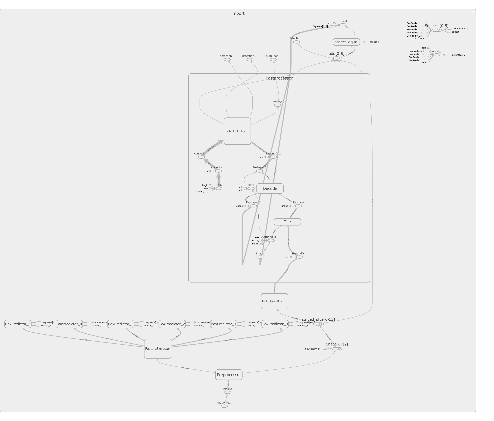<br>
after split ssd_mobilenet_v1_coco_2017_11_17:<br>
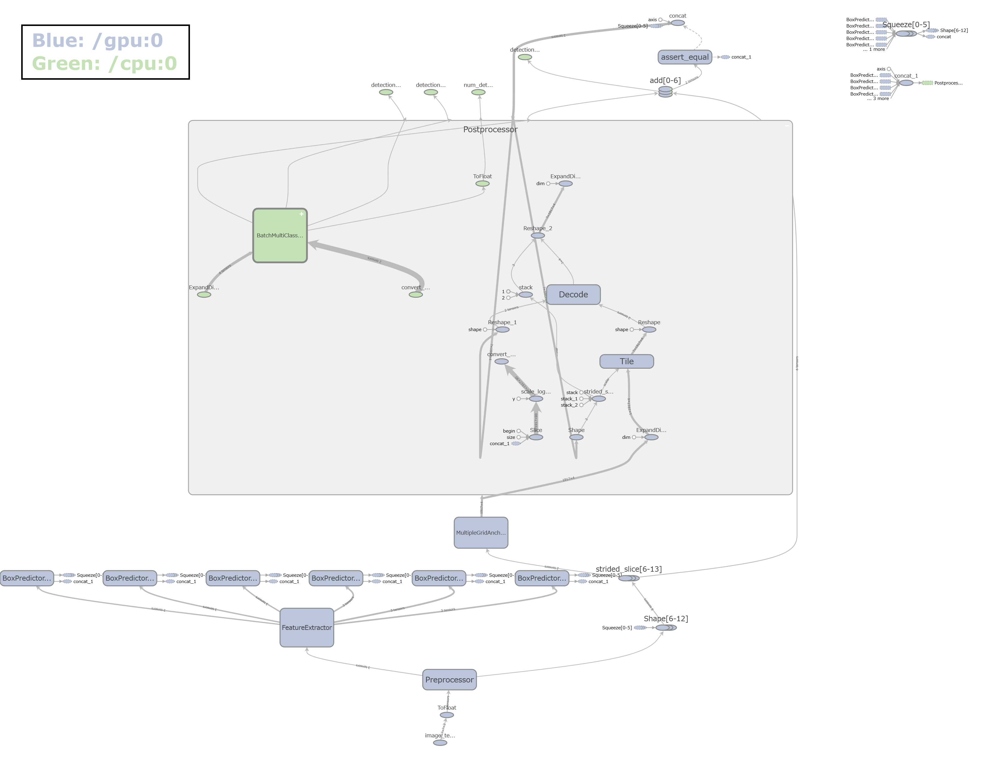<br>


## Learn how to divide ssd_mobilenet_v1_coco_2017_11_17 model.
### First point: Non-Maximum Suppression.
This has two input nodes.<br>
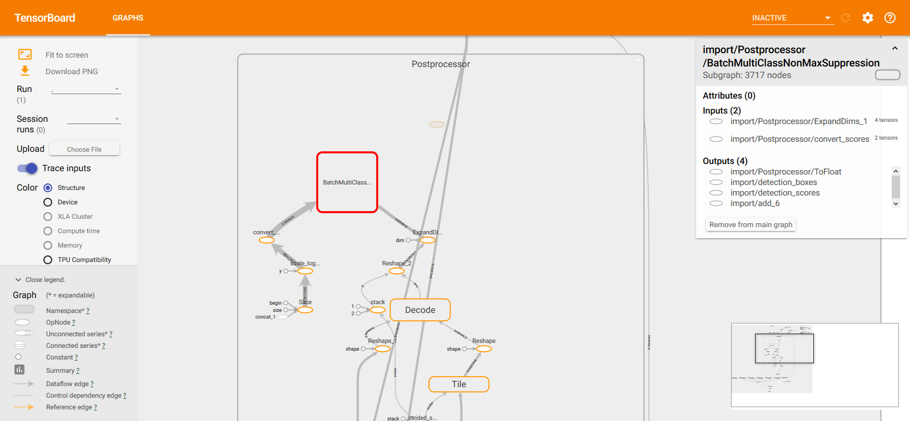<br>

<hr>

### Second point: Two input nodes: ExpandDims_1 and convert_scores.
#### Postprocessor/ExpandDims_1
Shape of ExpandDims_1 is ?x1917x1x4. (see output shape)<br>
"?" means that input array length is not fixed length.<br>

This input array length using as mini batch size "24" at the training time.<br>
At the prediction time, input image uses with array as [[image]]. This means the input array length is "1".<br>
(When the prediction time, you can predict multiple images at once.)<br>

In the training time and prediction time, input image array length is different. Therefore, the input is defined with tf.placeholder and the shape is defined as "None"(means not fixed array length).<br>

That "None" will appear as "?".<br>

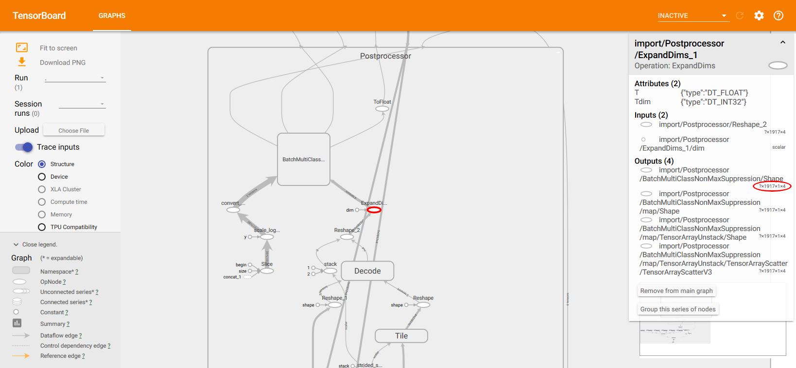<br>
Divide here.<br>
Write the definition of this division point in the source code:[lib/load_graph_nms_v1.py](lib/load_graph_nms_v1.py) as follows.<br>
```python
        SPLIT_TARGET_EXPAND_NAME = 'Postprocessor/ExpandDims_1'
```

#### Postprocessor/convert_scores
Shape of convert_scores is ?x1917x90. (see output shape)<br>

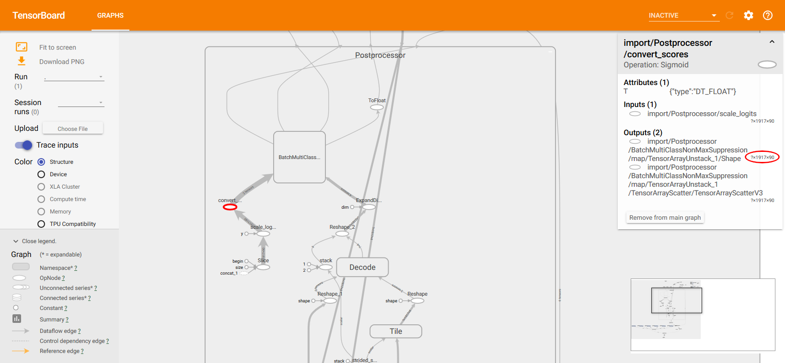<br>
Divide here.<br>
Write the definition of this division point in the source code:[lib/load_graph_nms_v1.py](lib/load_graph_nms_v1.py) as follows.<br>
```python
        SPLIT_TARGET_SCORE_NAME = 'Postprocessor/convert_scores'
```

<hr>

## Programming
### Add new inputs (score_in, expand_in) for secondary graph (cpu part).
Write new inputs in default graph with tf.placeholder. source code:[lib/load_graph_nms_v1.py](lib/load_graph_nms_v1.py)<br>
```python
        tf.reset_default_graph()
        if ssd_shape == 600:
            shape = 7326
        else:
            shape = 1917
        """ ADD CPU INPUT """
        score_in = tf.placeholder(tf.float32, shape=(None, shape, num_classes), name=SPLIT_TARGET_SCORE_NAME)
        expand_in = tf.placeholder(tf.float32, shape=(None, shape, 1, 4), name=SPLIT_TARGET_EXPAND_NAME)
```
The first, I reset the default graph. I wrote it to mean that the graph is empty at this time.<br>
The shape is in the previous graph diagram.<br>
Set the same name for name. The new input name is appended "_1" to the name automatically, so use it.<br>

### Get graph_def of new inputs.
Now, new inputs exist in default graph, get graph def from there.<br>
After get graph def of new inputs, reset default graph. New inputs tf.placeholder were created only for graph def. Don't need anymore.<br>
```python
        """
        Load placeholder's graph_def.
        """
        for node in tf.get_default_graph().as_graph_def().node:
            if node.name == SPLIT_TARGET_SCORE_NAME:
                score_def = node
            if node.name == SPLIT_TARGET_EXPAND_NAME:
                expand_def = node

        tf.reset_default_graph()
```

### Load Frozen Graph.
Load frozen graph to graph_def variable.<br>
```python
        graph_def = tf.GraphDef()
        with tf.gfile.GFile(model_path, 'rb') as fid:
            serialized_graph = fid.read()
            graph_def.ParseFromString(serialized_graph)
```
If non-split model, the loaded graph_def is imported into the default graph and return the default graph.<br>
```python
    def load_frozen_graph_without_split(self):
        """
        Load frozen_graph.
        """
        model_path = self.cfg['model_path']

        tf.reset_default_graph()

        graph_def = tf.GraphDef()
        with tf.gfile.GFile(model_path, 'rb') as fid:
            serialized_graph = fid.read()
            graph_def.ParseFromString(serialized_graph)
            tf.import_graph_def(graph_def, name='')
        """
        return
        """
        return tf.get_default_graph()
```
But in split model, processing continues.<br>

<hr>

Next is the most important code in model operation.<br>
Load all inputs of all nodes and write inputs into edges[NODE_NAME].<br>
```python
            """
            Check the connection of all nodes.
            edges[] variable has input information for all nodes.
            """
            edges = {}
            name_to_node_map = {}
            node_seq = {}
            seq = 0
            for node in graph_def.node:
                n = self.node_name(node.name)
                if n == SPLIT_TARGET_EXPAND_NAME or  n == SPLIT_TARGET_SCORE_NAME:
                    print(node)
                name_to_node_map[n] = node
                edges[n] = [self.node_name(x) for x in node.input]
                if n == SPLIT_TARGET_EXPAND_NAME or  n == SPLIT_TARGET_SCORE_NAME:
                    print(edges[n])
                node_seq[n] = seq
                seq += 1
```
The node 'Postprocessor/ExpandDims_1' has 2 inputs.<br>
Node of Postprocessor/ExpandDims_1:<br>
```
name: "Postprocessor/ExpandDims_1"
op: "ExpandDims"
input: "Postprocessor/Reshape_2"
input: "Postprocessor/ExpandDims_1/dim"
attr {
  key: "T"
  value {
    type: DT_FLOAT
  }
}
attr {
  key: "Tdim"
  value {
    type: DT_INT32
  }
}
```
Therefore, edges['Postprocessor/ExpandDims_1'] has 2 input node names.
Edge of Postprocessor/ExpandDims_1:<br>
```
['Postprocessor/Reshape_2', 'Postprocessor/ExpandDims_1/dim']
```
The node 'Postprocessor/convert_scores' has 1 input.<br>
Node of Postprocessor/convert_scores:<br>
```
name: "Postprocessor/convert_scores"
op: "Sigmoid"
input: "Postprocessor/scale_logits"
attr {
  key: "T"
  value {
    type: DT_FLOAT
  }
}
```
Therefore, edges['Postprocessor/convert_scores'] has 1 input node name.
Edge of Postprocessor/convert_scores:<br>
```
['Postprocessor/scale_logits']
```
As you can see, the edges[] variable has input information for all nodes.<br>

<hr>

Alert if split target is not in the graph.<br>
Raise ERROR is also good.<br>
```python
            """
            Alert if split target is not in the graph.
            """
            dest_nodes = [SPLIT_TARGET_SCORE_NAME, SPLIT_TARGET_EXPAND_NAME]
            for d in dest_nodes:
                assert d in name_to_node_map, "%s is not in graph" % d
```

<hr>

Follow all input nodes from the split point and add it into keep_list. This is GPU part.<br>
```python
            """
            Making GPU part.
            Follow all input nodes from the split point and add it into keep_list.
            """
            nodes_to_keep = set()
            next_to_visit = dest_nodes

            while next_to_visit:
                n = next_to_visit[0]
                del next_to_visit[0]
                if n in nodes_to_keep:
                    continue
                nodes_to_keep.add(n)
                next_to_visit += edges[n]

            nodes_to_keep_list = sorted(list(nodes_to_keep), key=lambda n: node_seq[n])

            keep = graph_pb2.GraphDef()
            for n in nodes_to_keep_list:
                keep.node.extend([copy.deepcopy(name_to_node_map[n])])
```

<hr>

Making CPU part is simple. It removes GPU part from loaded graph and add new inputs.<br>
```python
            """
            Making CPU part.
            It removes GPU part from loaded graph and add new inputs.
            """
            nodes_to_remove = set()
            for n in node_seq:
                if n in nodes_to_keep_list: continue
                nodes_to_remove.add(n)
            nodes_to_remove_list = sorted(list(nodes_to_remove), key=lambda n: node_seq[n])

            remove = graph_pb2.GraphDef()
            remove.node.extend([score_def])
            remove.node.extend([expand_def])
            for n in nodes_to_remove_list:
                remove.node.extend([copy.deepcopy(name_to_node_map[n])])
```

<hr>

Finally, add device info and import into the default graph. And return the default graph.<br>
```python
            """
            Import graph_def into default graph.
            """
            with tf.device('/gpu:0'):
                tf.import_graph_def(keep, name='')
            with tf.device('/cpu:0'):
                tf.import_graph_def(remove, name='')

        return tf.get_default_graph()
```

<hr>

### Use split model.
The input of the primary graph (gpu part) does not change and it is image array. The output operation names are ExpandDims_1 and convert_scores.<br>

The input of secondary graph (cpu part) becomes expand_in and score_in created with tf.placeholder. The output operation names are not change, these are detection_boxes, detection_scores, detection_classes and num_detections.<br>

If load_graph() returns expand_in and score_in, I can use it for secondary graph's input tensor. But I wrote it with graph.get_tensor_by_name() like any other operations.<br>
source code:[lib/detection_nms_v1.py](lib/detection_nms_v1.py)<br>
```python
        if SPLIT_MODEL:
            score_out = graph.get_tensor_by_name('Postprocessor/convert_scores:0')
            expand_out = graph.get_tensor_by_name('Postprocessor/ExpandDims_1:0')
            score_in = graph.get_tensor_by_name('Postprocessor/convert_scores_1:0')
            expand_in = graph.get_tensor_by_name('Postprocessor/ExpandDims_1_1:0')
```

<hr>

## Diagram of split model.
New Output: ExpandDims_1 and convert_scores.<br>
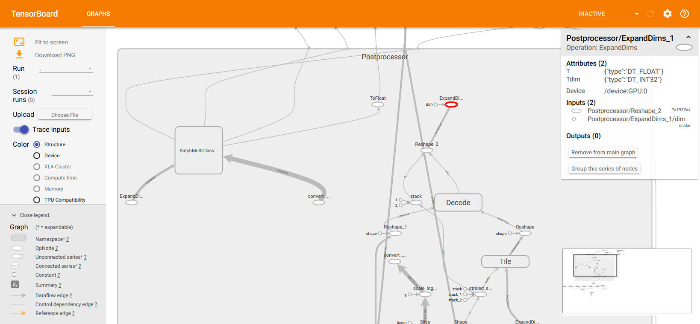<br>
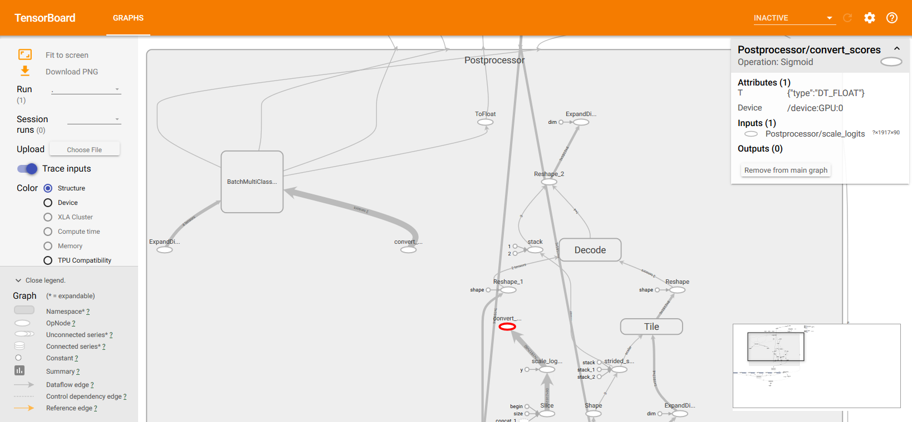<br>

New Input: ExpandDims_1_1 and convert_scores_1.<br>
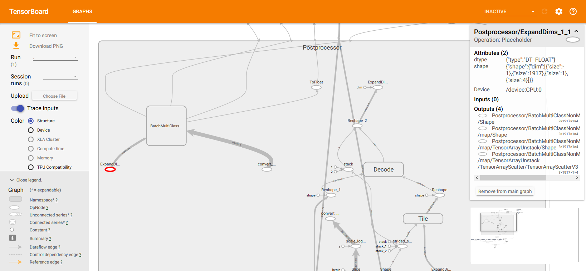<br>
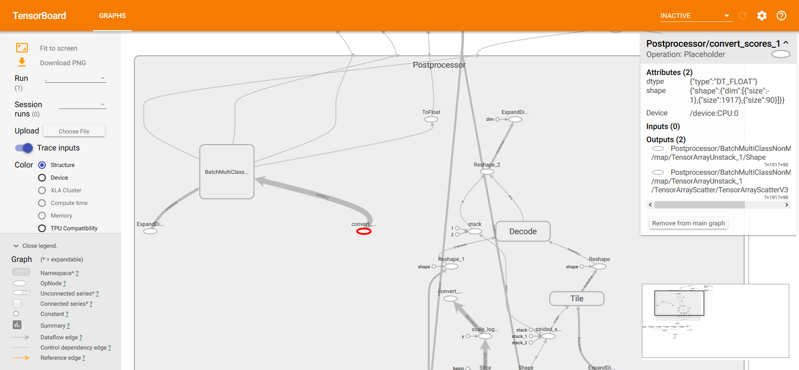<br>

<hr>

## Split model for new Non-Maximum Suppression.
In 2018, we know ssd_mobilenet_v1 was something changed.<br>
And we also know ssd_mobilenet_v2 was uploaded.<br>
Ok, let's check ssd_mobilenet_v2 first.<br>


Looking at graph, I can see that there are three inputs.<br>
Graph diagram of ssd_mobilenet_v2_2018_03_29:<br>
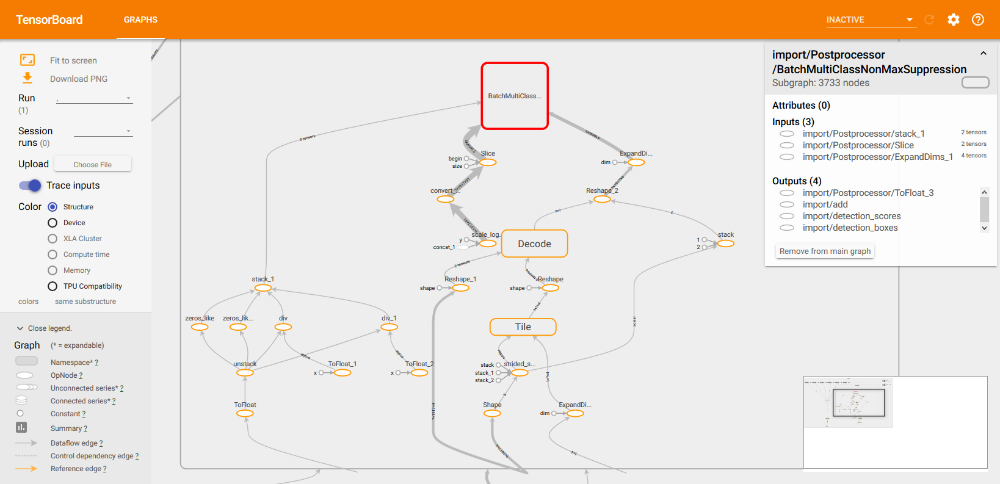<br>

<hr>

### Let's look at these input nodes.
See type and output shape.<br>
ExpandDims_1 is the same as previous one.<br>
And, what is Slice? It seems convert_scores. Just renamed it.<br>
And, what is stack_1? This is new face!<br>

ExpandDims_1:<br>
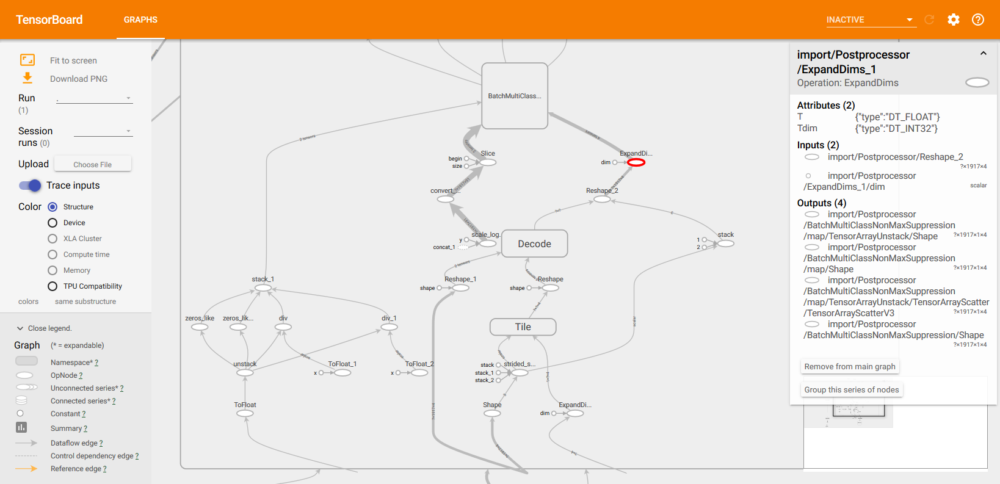<br>
Slice:<br>
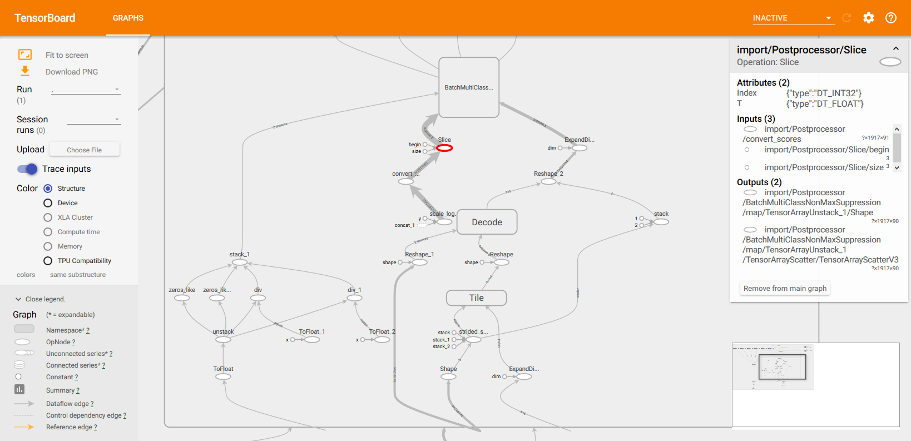<br>
stack_1:<br>
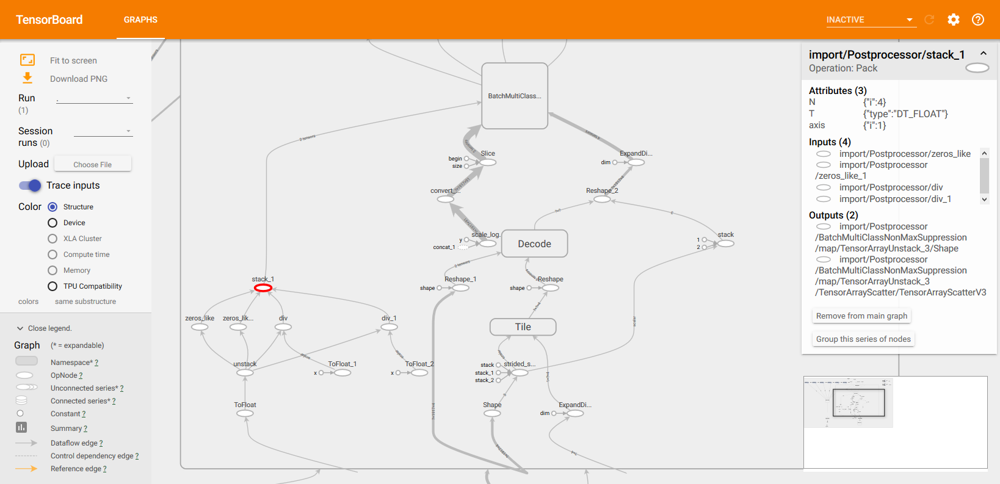<br>

### Write code and build graph.
stack_1 seems to be an array of Float. That is, tf.placeholder with shape is None.<br>
source code:[lib/load_graph_nms_v2.py](lib/load_graph_nms_v1.py)<br>
```python
        """ ADD CPU INPUT """
        slice1_in = tf.placeholder(tf.float32, shape=(None, shape, num_classes), name=SPLIT_TARGET_SLICE1_NAME)
        expand_in = tf.placeholder(tf.float32, shape=(None, shape, 1, 4), name=SPLIT_TARGET_EXPAND_NAME) # shape=output shape
        stack_in = tf.placeholder(tf.float32, shape=(None), name=SPLIT_TARGET_TOSTACK_NAME) # array of float
```
```python
        """
        Load placeholder's graph_def.
        """
        for node in tf.get_default_graph().as_graph_def().node:
            if node.name == SPLIT_TARGET_SLICE1_NAME:
                slice1_def = node
            if node.name == SPLIT_TARGET_EXPAND_NAME:
                expand_def = node
            if node.name == SPLIT_TARGET_STACK_NAME:
                stack_def = node

        tf.reset_default_graph()
```
```python
            """
            Alert if split target is not in the graph.
            """
            dest_nodes = [SPLIT_TARGET_SLICE1_NAME, SPLIT_TARGET_EXPAND_NAME, SPLIT_TARGET_STACK_NAME]
            for d in dest_nodes:
                assert d in name_to_node_map, "%s is not in graph" % d
```
```python
            remove = graph_pb2.GraphDef()
            remove.node.extend([slice1_def])
            remove.node.extend([expand_def])
            remove.node.extend([stack_def])
            for n in nodes_to_remove_list:
                remove.node.extend([copy.deepcopy(name_to_node_map[n])])
```
Build split graph.<br>
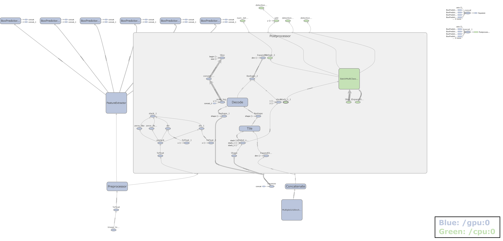<br>

### Write code and run.
Operations.<br>
source code:[lib/detection_nms_v2.py](lib/detection_nms_v2.py)<br>
```python
        if SPLIT_MODEL:
            slice1_out = graph.get_tensor_by_name('Postprocessor/Slice:0')
            expand_out = graph.get_tensor_by_name('Postprocessor/ExpandDims_1:0')
            slice1_in = graph.get_tensor_by_name('Postprocessor/Slice_1:0')
            expand_in = graph.get_tensor_by_name('Postprocessor/ExpandDims_1_1:0')
            stack_out = graph.get_tensor_by_name('Postprocessor/stack_1:0')
            stack_in = graph.get_tensor_by_name('Postprocessor/stack_1_1:0')
```
Of course, arguments and returns of sess.run() use this.<br>


## Check Other Models.
* ssdlite_mobilenet_v2_coco_2018_05_09
* ssd_inception_v2_coco_2018_01_28
* ssd_mobilenet_v1_coco_2018_01_28

These are the same BatchMultiClassNonMaxSuppression inputs as ssd_mobilenet_v2_coco_2018_03_29.<br>
ssdlite_mobilenet_v2_coco_2018_05_09:<br>
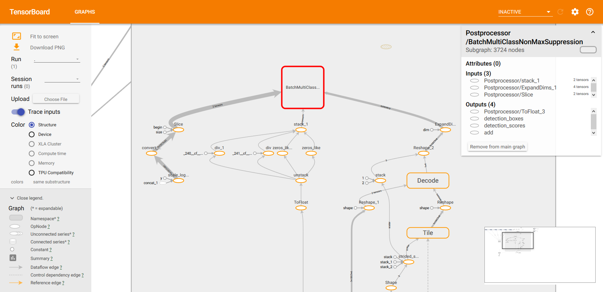<br>
ssd_inception_v2_coco_2018_01_28:<br>
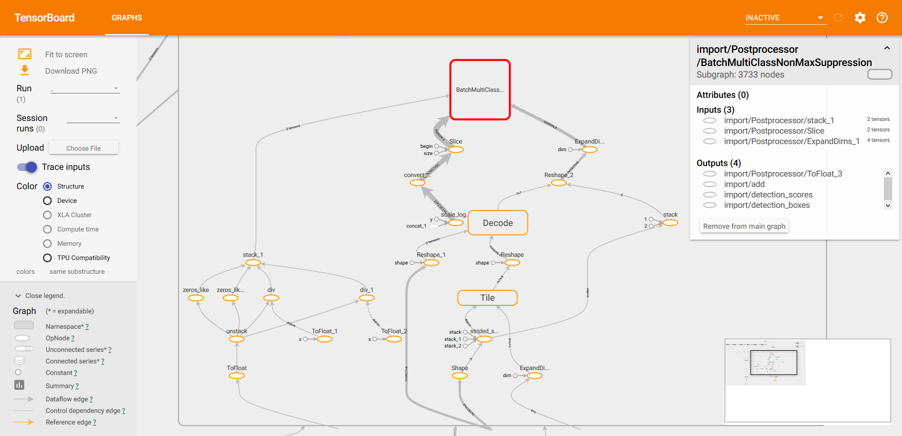<br>
ssd_mobilenet_v1_coco_2018_01_28:<br>
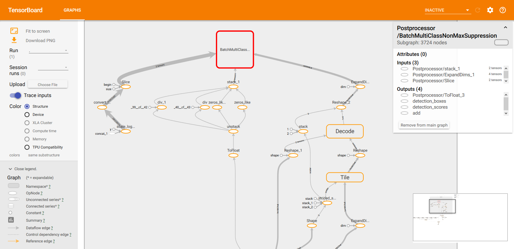<br>
