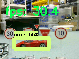
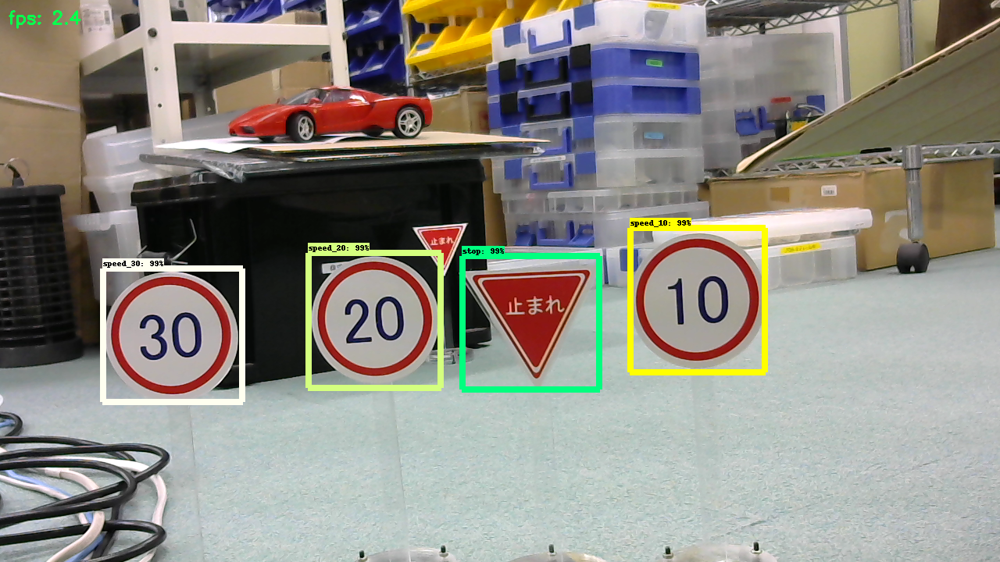

# Tensorflow realtime_object_detection on Jetson TX2

## About this repository
forked from GustavZ/realtime_object_detection: [https://github.com/GustavZ/realtime_object_detection](https://github.com/GustavZ/realtime_object_detection)

## Getting Started:
- login Jetson TX2 `ssh -C -Y ubuntu@xxx.xxx.xxx.xxx`
- run `realtime_object_detection.py` thread version of realtime object detection
- wait few minuts.
 

## My Setup:
- Jetson TX2
- JetPack 3.1
- Python 3.6
- OpenCV 3.3.1/Tensorflow 1.4.1
- OpenCV 3.4.0/Tensorflow 1.5.0
- OpenCV 3.4.0/Tensorflow 1.6.0
  

## Current max Performance on `ssd_mobilenet` (with visualization 160x120):
- Nvidia Jetson Tx2 with Tegra 8GB:                           **5fps - 30 fps**
  

 

