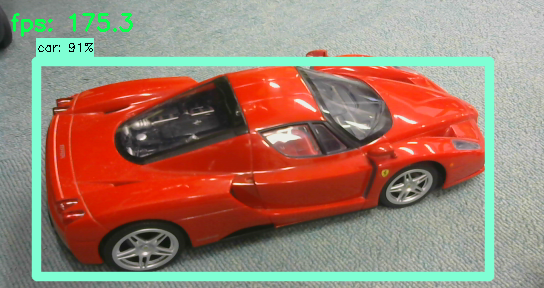
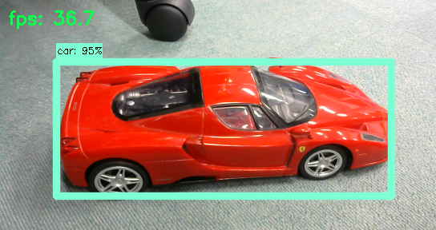

# Tensorflow realtime_object_detection on Jetson TX2/TX1/PC

## About this repository
forked from GustavZ/realtime_object_detection: [https://github.com/GustavZ/realtime_object_detection](https://github.com/GustavZ/realtime_object_detection)  
And focused on model split technique of ssd_mobilenet_v1.  

Support models:  
* ssd_mobilenet_v1 (ver. 2017_11_17)
* ssd_mobilenet_v1 (ver. 2018_01_28)
* ssd_mobilenet_v2 (ver. 2018_03_29)
* ssdlite_mobilenet_v2 (ver. 2018_05_09)
* ssd_inception_v2 (ver. 2018_01_28)

See also:[https://github.com/tensorflow/models/issues/3270](https://github.com/tensorflow/models/issues/3270)

## Getting Started:
- login Jetson TX2. Desktop login or ssh remote login. `ssh -C -Y ubuntu@xxx.xxx.xxx.xxx`
- edit `config.yml` for your environment. (Ex. video_input: 0 # for PC)
- run `python run_object_detection.py` realtime object detection (Multi-Threading)
- wait few minuts.
- Multi-Threading is better performance than Multi-Processing. Multi-Processing bottleneck is interprocess communication.
<br />

## Requirements:
```
pip install --upgrade pyyaml
```
Also, OpenCV >= 3.1 and Tensorflow >= 1.4 (1.6 is good)

## config.yml
#### Camera
This is OpenCV argument.
* USB Webcam on PC
```
video_input: 0
```
* USB Webcam on TX2
```
video_input: 1
```
* Onboard camera on TX2
```
video_input: "nvcamerasrc ! video/x-raw(memory:NVMM), width=(int)1280, height=(int)720,format=(string)I420, framerate=(fraction)30/1 ! nvvidconv flip-method=0 ! video/x-raw, format=(string)BGRx ! videoconvert ! video/x-raw, format=(string)BGR ! appsink"
```

####  Without Visualization
I do not know why, but in TX2 force_gpu_compatible: True it will be faster.
* on TX2
```
force_gpu_compatible: True
visualize: False
```
* on PC
```
force_gpu_compatible: False
visualize: False
```

#### With Visualization
Visualization is heavy. Visualization FPS possible to limit.<br>
Display FPS: Detection FPS.<br>
* default is with Single-Processing and show every frames.
```
visualize: True
vis_worker: False
max_vis_fps: 0
vis_text: True
```
* Visualization FPS limit with Single-Processing
```
visualize: True
vis_worker: False
max_vis_fps: 30
vis_text: True
```
* Visualization FPS limit with Multi-Processing
```
visualize: True
vis_worker: True
max_vis_fps: 30
vis_text: True
```

* Model type  
The ssd_mobilenet_v1_coco_2017_11_17 has 4913 nodes. I will call this version 'ssd_v1'.<br>
The ssd_mobilenet_v1_coco_2018_01_28 has 4104 nodes. I will call this version 'ssd_v2'.<br>
And ssd_mobilenet_v2_coco_2018_03_29, ssdlite_mobilenet_v2_coco_2018_05_09, ssd_inception_v2_coco_2018_01_28 also 'ssd_v2'.<br>
The difference between 'ssd_v1' and 'ssd_v2' is BatchMultiClassNonMaxSuppression inputs.<br>
```
# ssd_mobilenet_v1_coco_2018_01_28 4104 nodes
model_type: 'ssd_v2'
model_path: 'models/ssd_mobilenet_v1_coco/frozen_inference_graph.pb'
label_path: 'models/ssd_mobilenet_v1_coco/mscoco_label_map.pbtxt'
num_classes: 90
```


## Console Log
```
FPS:25.8  Frames:130 Seconds: 5.04248   | 1FRAME total: 0.11910   cap: 0.00013   gpu: 0.03837   cpu: 0.02768   lost: 0.05293   send: 0.03834   | VFPS:25.4  VFrames:128 VDrops: 1 
```
FPS: detection fps. average fps of fps_interval (5sec). <br>
Frames: detection frames in fps_interval. <br>
Seconds: fps_interval running time. <br>

<hr>

1FRAME<br>
total: 1 frame's processing time. 0.1 means delay and 10 fps if it is single-threading. In multi-threading, this value means delay. <br>
cap: time of capture camera image and transform for model input. <br>
gpu: sess.run() time of gpu part. <br>
cpu: sess.run() time of cpu part. <br>
lost: time of overhead, something sleep etc. <br>
send: time of multi-processing queue, block and pipe time. <br>

<hr>

VFPS: visualization fps. <br>
VFrames: visualization frames in fps_interval. <br>
VDrops: When multi-processing visualization is bottleneck, drops. <br>

## Updates:
- Support ssd_mobilenet_v2, ssdlite_mobilenet_v2 and ssd_inception_v2_coco. : Download model from here: [detection_model_zoo](https://github.com/tensorflow/models/blob/master/research/object_detection/g3doc/detection_model_zoo.md)

- Add Multi-Processing visualization. : Detection and visualization are asynchronous.

- Drop unused files.

- Add force_gpu_compatible option. : ssd_mobilenet_v1_coco 34.5 FPS without vizualization 1280x720 on TX2.

- Multi-Processing version corresponds to python 3.6 and python 2.7.
- Launch speed up.              : Improve startup time from 90sec to 78sec.
- Add time details.             : To understand the processing time well.

- Separate split and non-split code.     : Remove unused session from split code.
- Remove Session from load frozen graph. : Reduction of memory usage.

- Flexible sleep_interval.          : Maybe speed up on high performance PC.
- FPS separate to multi-processing. : Speed up.
- FPS streaming calculation.        : Flat fps.
- FPS is average of fps_interval.   : Flat fps.
- FPS updates every 0.2 sec.        : Flat fps.

- solve: Multiple session cannot launch problem. tensorflow.python.framework.errors_impl.InternalError: Failed to create session.

## My Setup:
* PC
  * CPU: i7-8700 3.20GHz 6-core 12-threads
  * GPU: NVIDIA GTX1060 6GB
  * MEMORY: 32GB
  * Ubuntu 16.04
    * docker-ce
    * nvidia-docker
      * nvidia/cuda
      * Pyton 2.7.12/OpenCV 3.4.1/Tensorflow 1.6.1
      * Pyton 3.6.5/OpenCV 3.4.1/Tensorflow 1.6.1
* Jetson TX2
  * JetPack 3.2/3.2.1
    * Python 3.6
    * OpenCV 3.4.1/Tensorflow 1.6.0
    * OpenCV 3.4.1/Tensorflow 1.6.1
    * OpenCV 3.4.1/Tensorflow 1.7.0 (slow)
    * OpenCV 3.4.1/Tensorflow 1.7.1 (slow)
    * OpenCV 3.4.1/Tensorflow 1.8.0 (slow)
  * JetPack 3.1
    * Python 3.6
    * OpenCV 3.3.1/Tensorflow 1.4.1
    * OpenCV 3.4.0/Tensorflow 1.5.0
    * OpenCV 3.4.1/Tensorflow 1.6.0
    * OpenCV 3.4.1/Tensorflow 1.6.1 (Main)
* Jetson TX1
  * SSD Storage
  * JetPack 3.2
    * Python 3.6
    * OpenCV 3.4.1/Tensorflow 1.6.0
<br />

## NVPMODEL
| Mode | Mode Name | Denver 2 | Frequency | ARM A57 | Frequency | GPU Frequency |
|:--|:--|:--|:--|:--|:--|:--|
| 0 | Max-N | 2 | 2.0 GHz | 4 | 2.0 GHz | 1.30 GHz |
| 1 | Max-Q | 0 | | 4 | 1.2 GHz | 0.85 GHz |
| 2 | Max-P Core-All | 2 | 1.4 GHz | 4 | 1.4 GHz | 1.12 GHz |
| 3 | Max-P ARM | 0 | | 4 | 2.0 GHz | 1.12 GHz |
| 4 | Max-P Denver | 2 | 2.0 GHz | 0 | | 1.12 GHz |

Max-N
```
sudo nvpmodel -m 0
sudo ./jetson_clocks.sh
```

Max-P ARM(Default)
```
sudo nvpmodel -m 3
sudo ./jetson_clocks.sh
```

Show current mode
```
sudo nvpmodel -q --verbose
```

## Current Max Performance of ssd_mobilenet_v1
| FPS | Machine | Size | Multi | Visualize | Mode | CPU | Watt | Ampere | Volt-Ampere | Model | classes |
|:--|:--|:--|:--|:--|:--|:--|:--|:--|:--|:--|:--|
| 205 | PC | 160x120 | Multi-Threading | False | - | 22-25% | 168W | 1.68A | 170VA | frozen_inference_graph.pb | 90 |
| 201 | PC | 160x120 | Multi-Threading | Worker 30 FPS Limit | - | 22-26% | 170W | 1.68A | 172VA | frozen_inference_graph.pb | 90 |
| 195 | PC | 160x120 | Multi-Threading | True | - | 22-27% | 172W | 1.69A | 173VA | frozen_inference_graph.pb | 90 |
| 195 | PC | 544x288 | Multi-Threading | False | - | 37-42% | 178W | 1.75A | 179VA | frozen_inference_graph.pb | 90 |
| 189 | PC | 544x288 | Multi-Threading | Worker 30 FPS Limit | - | 40-44% | 172W | 1.71A | 174VA | frozen_inference_graph.pb | 90 |
| 175 | PC | 544x288 | Multi-Threading | True | - | 44-52% | 175W | 1.77A | 177VA | frozen_inference_graph.pb | 90 |
| 159 | PC | 1280x720 | Multi-Threading | False | - | 37-42% | 168W | 1.65A | 169VA | frozen_inference_graph.pb | 90 |
| 149 | PC | 1280x720 | Multi-Threading | Worker 30 FPS Limit | - | 43-52% | 168W | 1.65A | 170VA | frozen_inference_graph.pb | 90 |
| 140 | PC | 1280x720 | Multi-Threading | Worker 60 FPS Limit | - | 43-51% | 166W | 1.64A | 168VA | frozen_inference_graph.pb | 90 |
| 136 | PC | 1280x720 | Multi-Threading | Worker 67 FPS | - | 47-53% | 168W | 1.65A | 170VA | frozen_inference_graph.pb | 90 |
| 79 | PC | 1280x720 | Multi-Threading | True | - | 22-33% | 143W | 1.41A | 144VA | frozen_inference_graph.pb | 90 |
| 40 | TX2 | 160x120 | Multi-Threading | False | Max-N | 62-68% | 18.1W | 0.29A | 29.6VA | frozen_inference_graph.pb | 90 |
| 37 | TX2 | 544x288 | Multi-Threading | False | Max-N | 59-73% | 18.1W | 0.29A | 29.4VA | frozen_inference_graph.pb | 90 |
| 36 | TX2 | 160x120 | Multi-Threading | False | Max-P ARM | 78-83% | 14.4W | 0.23A | 23.5VA | frozen_inference_graph.pb | 90 |
| 35 | TX2 | 1280x720 | Multi-Threading | False | Max-N | 48-70% | 17.5W | 0.29A | 29.0VA | frozen_inference_graph.pb | 90 |
| 34 | TX2 | 160x120 | Multi-Threading | True | Max-P ARM | 70-73% | 14.1W | 0.23A | 23.1VA | frozen_inference_graph.pb | 90 |
| 34 | TX2 | 160x120 | Multi-Threading | True | Max-N | 0-62% | 16.1W | 0.26A | 26.2VA | frozen_inference_graph.pb | 90 |
| 34 | TX2 | 544x288 | Multi-Threading | False | Max-P ARM | 79-83% | 14.1W | 0.23A | 23.4VA | frozen_inference_graph.pb | 90 |
| 32 | TX2 | 544x288 | Multi-Threading | True | Max-N | 13-72% | 16.7W | 0.27A | 27.1VA | frozen_inference_graph.pb | 90 |
| 31 | TX2 | 1280x720 | Multi-Threading | False | Max-P ARM | 78-81% | 13.3W | 0.22A | 22.6VA | frozen_inference_graph.pb | 90 |
| 30 | TX2 | 544x288 | Multi-Threading | True | Max-P ARM | 72-80% | 13.9W | 0.22A | 22.8VA | frozen_inference_graph.pb | 90 |
| 29 | TX2 | 1280x720 | Multi-Threading | True | Max-N | 18-73% | 16.6W | 0.27A | 27.1VA | frozen_inference_graph.pb | 90 |
| 24 | TX2 | 1280x720 | Multi-Threading | True | Max-P ARM | 75-80% | 12.7W | 0.21A | 21.7VA | frozen_inference_graph.pb | 90 |
| 24 | TX1 | 160x120 | Multi-Threading | False | - | 62-72% | 17.0W | 0.28A | 29.4VA | frozen_inference_graph.pb | 90 |
| 23 | TX1 | 160x120 | Multi-Threading | True | - | 62-73% | 16.9W | 0.27A | 28.1VA | frozen_inference_graph.pb | 90 |
| 23 | TX1 | 544x288 | Multi-Threading | False | - | 64-72% | 16.9W | 0.28A | 29.7VA | frozen_inference_graph.pb | 90 |
| 21 | TX1 | 1280x720 | Multi-Threading | False | - | 60-68% | 16.0W | 0.26A | 27.3VA | frozen_inference_graph.pb | 90 |
| 20 | TX1 | 544x288 | Multi-Threading | True | - | 69-77% | 16.4W | 0.26A | 27.8VA | frozen_inference_graph.pb | 90 |
| 18 | TX1 | 1280x720 | Multi-Threading | True | - | 70-83% | 15.7W | 0.26A | 26.6VA | frozen_inference_graph.pb | 90 |

on PC 544x288:<br>
<br>
on TX2 544x288:<br>
<br>


## Youtube
#### Robot Car and Realtime Object Detection
[](https://www.youtube.com/watch?v=FoRKFw6xoAY)

#### Object Detection vs Semantic Segmentation on TX2
[](https://www.youtube.com/watch?v=p4EeF0LGcw8)
#### Realtime Object Detection on TX2
[](https://www.youtube.com/watch?v=554GqG21c8M)
#### Realtime Object Detection on TX1
[](https://www.youtube.com/watch?v=S4tozDI5ncY)

Movie's FPS is little bit slow down. Because run ssd_movilenet_v1 with desktop capture.<br>
Capture command:<br>
```
gst-launch-1.0 -v ximagesrc use-damage=0 ! nvvidconv ! 'video/x-raw(memory:NVMM),alignment=(string)au,format=(string)I420,framerate=(fraction)25/1,pixel-aspect-ratio=(fraction)1/1' ! omxh264enc !  'video/x-h264,stream-format=(string)byte-stream' ! h264parse ! avimux ! filesink location=capture.avi
```

## Training ssd_mobilenet with own data
[https://github.com/naisy/train_ssd_mobilenet](https://github.com/naisy/train_ssd_mobilenet)

## Multi-Threading for Realtime Object Detection
[Multi-Threading for Realtime Object Detection](About_Multi-Threading.md)