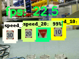

# Tensorflow realtime_object_detection on Jetson TX2

## About this repository
forked from GustavZ/realtime_object_detection: [https://github.com/GustavZ/realtime_object_detection](https://github.com/GustavZ/realtime_object_detection)

## Getting Started:
- login Jetson TX2 `ssh -C -Y ubuntu@xxx.xxx.xxx.xxx`
- run `python object_detection.py` realtime object detection (Multi-Thread)
- run `python realtime_object_detection.py` realtime object detection (Multi-Process)
- wait few minuts.
- Multi-Thread is better performance. Multi-Process bottleneck is interprocess communication.
<br />

## My Setup:
* Jetson TX2
  * JetPack 3.2
    * Python 3.6
    * OpenCV 3.4.1/Tensorflow 1.6.0
  * JetPack 3.1
    * Python 3.6
    * OpenCV 3.3.1/Tensorflow 1.4.1 (Main)
    * OpenCV 3.4.0/Tensorflow 1.5.0
    * OpenCV 3.4.0/Tensorflow 1.6.0

<br />

## NVPMODEL
| Mode | Mode Name | Denver 2 | Frequency | ARM A57 | Frequency | GPU Frequency |
|:--|:--|:--|:--|:--|:--|:--|
| 0 | Max-N | 2 | 2.0 GHz | 4 | 2.0 GHz | 1.30 GHz |
| 1 | Max-Q | 0 | | 4 | 1.2 GHz | 0.85 GHz |
| 2 | Max-P Core-All | 2 | 1.4 GHz | 4 | 1.4 GHz | 1.12 GHz |
| 3 | Max-P ARM | 0 | | 4 | 2.0 GHz | 1.12 GHz |
| 4 | Max-P Denver | 2 | 2.0 GHz | 0 | | 1.12 GHz |

Max-N
```
sudo nvpmodel -m 0
sudo ./jetson_clocks.sh
```

Max-P ARM(Default)
```
sudo nvpmodel -m 3
sudo ./jetson_clocks.sh
```

Show current mode
```
sudo nvpmodel -q --verbose
```

## Current max Performance on `ssd_mobilenet` (with visualization 160x120):
| FPS | Multi | Mode | CPU | Watt | Ampere | Volt-Ampere | Model | classes |
|:--|:--|:--|:--|:--|:--|:--|:--|:--|
| 40 | Multi-Thread | Max-N | 27-55% | 15.6W | 0.27A | 27.8VA | roadsign_frozen_inference_graph_v1_2nd_4k.pb | 4 |
| 36 | Multi-Thread | Max-P ARM | 50-59% | 12.1W | 0.21A | 21.9VA | roadsign_frozen_inference_graph_v1_2nd_4k.pb | 4 |
| 35 | Multi-Process | Max-N | 0-64% | 14.7W | 0.25A | 25.4VA | roadsign_frozen_inference_graph_v1_2nd_4k.pb | 4 |
| 33 | Multi-Process | Max-P ARM | 49-55% | 11.6W | 0.20A | 20.1VA | roadsign_frozen_inference_graph_v1_2nd_4k.pb | 4 |

<br>


## Training ssd_mobilenet with own data
[https://github.com/naisy/train_ssd_mobilenet](https://github.com/naisy/train_ssd_mobilenet)